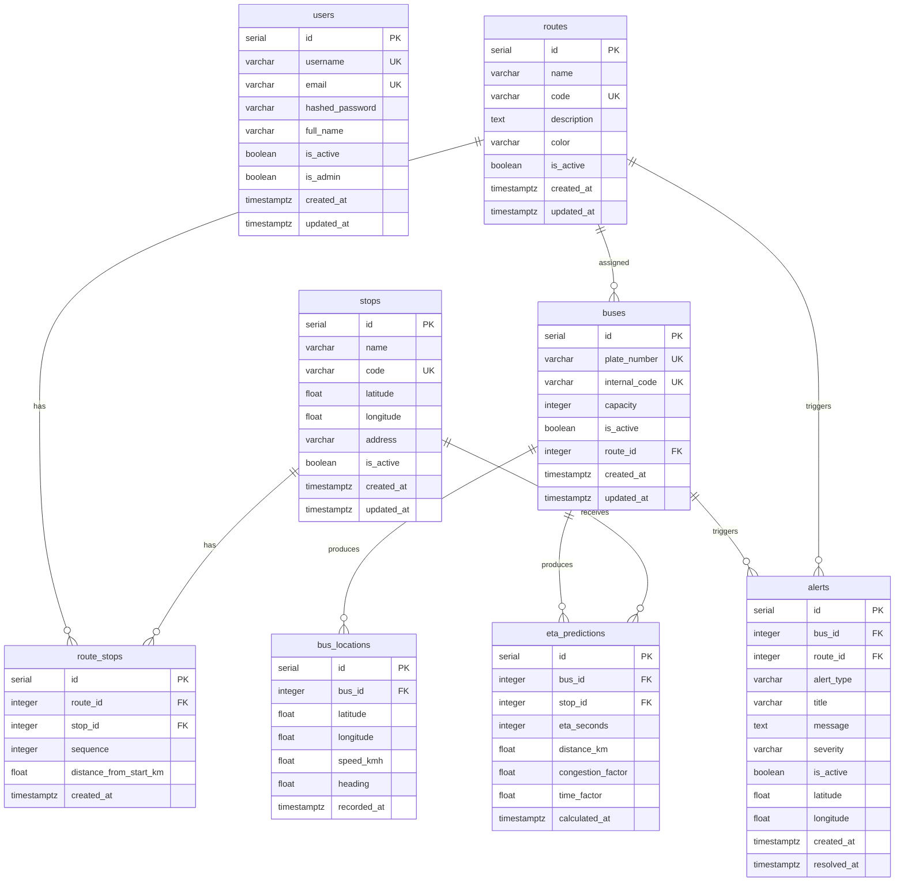

# MetroLinea - Database Documentation

## Overview
PostgreSQL database for the MetroLinea intelligent transit system. Stores routes, stops, buses, GPS locations, ETA predictions, and alerts.

## Connection

```bash
psql -h localhost -U metrolinea -d metrolinea_db
# Password: metrolinea_secret
```

```
Host: localhost (or db in Docker)
Port: 5432
Database: metrolinea_db
User: metrolinea
Password: metrolinea_secret
```

## Tables

### users
Platform users (admins and regular users).

| Column | Type | Constraints |
|--------|------|-------------|
| id | SERIAL | PK |
| username | VARCHAR(50) | UNIQUE NOT NULL |
| email | VARCHAR(255) | UNIQUE NOT NULL |
| hashed_password | VARCHAR(255) | NOT NULL |
| full_name | VARCHAR(255) | NOT NULL |
| is_active | BOOLEAN | DEFAULT TRUE |
| is_admin | BOOLEAN | DEFAULT FALSE |
| created_at | TIMESTAMPTZ | DEFAULT NOW() |
| updated_at | TIMESTAMPTZ | DEFAULT NOW() |

### routes
Bus routes (lines) in the transit network.

| Column | Type | Constraints |
|--------|------|-------------|
| id | SERIAL | PK |
| name | VARCHAR(100) | NOT NULL |
| code | VARCHAR(20) | UNIQUE NOT NULL |
| description | TEXT | NULLABLE |
| color | VARCHAR(7) | DEFAULT '#3B82F6' |
| is_active | BOOLEAN | DEFAULT TRUE |
| created_at | TIMESTAMPTZ | DEFAULT NOW() |
| updated_at | TIMESTAMPTZ | DEFAULT NOW() |

### stops
Bus stops with GPS coordinates.

| Column | Type | Constraints |
|--------|------|-------------|
| id | SERIAL | PK |
| name | VARCHAR(200) | NOT NULL |
| code | VARCHAR(20) | UNIQUE NOT NULL |
| latitude | FLOAT | -90 to 90 |
| longitude | FLOAT | -180 to 180 |
| address | VARCHAR(300) | NULLABLE |
| is_active | BOOLEAN | DEFAULT TRUE |
| created_at | TIMESTAMPTZ | DEFAULT NOW() |
| updated_at | TIMESTAMPTZ | DEFAULT NOW() |

### route_stops
Junction table linking routes and stops.

| Column | Type | Constraints |
|--------|------|-------------|
| id | SERIAL | PK |
| route_id | INTEGER | FK(routes.id) CASCADE |
| stop_id | INTEGER | FK(stops.id) CASCADE |
| sequence | INTEGER | NOT NULL |
| distance_from_start_km | FLOAT | DEFAULT 0.0 |
| created_at | TIMESTAMPTZ | DEFAULT NOW() |

**Unique constraint:** (route_id, stop_id)

### buses
Fleet vehicles assigned to routes.

| Column | Type | Constraints |
|--------|------|-------------|
| id | SERIAL | PK |
| plate_number | VARCHAR(20) | UNIQUE NOT NULL |
| internal_code | VARCHAR(30) | UNIQUE NOT NULL |
| capacity | INTEGER | DEFAULT 40 |
| is_active | BOOLEAN | DEFAULT TRUE |
| route_id | INTEGER | FK(routes.id) NULLABLE |
| created_at | TIMESTAMPTZ | DEFAULT NOW() |
| updated_at | TIMESTAMPTZ | DEFAULT NOW() |

### bus_locations
GPS position history.

| Column | Type | Constraints |
|--------|------|-------------|
| id | SERIAL | PK |
| bus_id | INTEGER | FK(buses.id) CASCADE |
| latitude | FLOAT | NOT NULL |
| longitude | FLOAT | NOT NULL |
| speed_kmh | FLOAT | DEFAULT 0.0 |
| heading | FLOAT | DEFAULT 0.0 |
| recorded_at | TIMESTAMPTZ | DEFAULT NOW() |

### eta_predictions
Calculated ETA predictions.

| Column | Type | Constraints |
|--------|------|-------------|
| id | SERIAL | PK |
| bus_id | INTEGER | FK(buses.id) CASCADE |
| stop_id | INTEGER | FK(stops.id) CASCADE |
| eta_seconds | INTEGER | NOT NULL |
| distance_km | FLOAT | NOT NULL |
| congestion_factor | FLOAT | DEFAULT 1.0 |
| time_factor | FLOAT | DEFAULT 1.0 |
| calculated_at | TIMESTAMPTZ | DEFAULT NOW() |

### alerts
Operational alerts.

| Column | Type | Constraints |
|--------|------|-------------|
| id | SERIAL | PK |
| bus_id | INTEGER | FK(buses.id) CASCADE, NULLABLE |
| route_id | INTEGER | FK(routes.id) CASCADE, NULLABLE |
| alert_type | VARCHAR(30) | CHECK(IN) |
| title | VARCHAR(200) | NOT NULL |
| message | TEXT | NOT NULL |
| severity | VARCHAR(20) | CHECK(IN), DEFAULT 'LOW' |
| is_active | BOOLEAN | DEFAULT TRUE |
| latitude | FLOAT | NULLABLE |
| longitude | FLOAT | NULLABLE |
| created_at | TIMESTAMPTZ | DEFAULT NOW() |
| resolved_at | TIMESTAMPTZ | NULLABLE |

**Allowed alert_type values:** DELAY, CONGESTION, BUS_STOPPED, MAINTENANCE, ROUTE_CHANGE
**Allowed severity values:** LOW, MEDIUM, HIGH, CRITICAL

## ER Diagram



## Data Flow

```
GPS Device → bus_locations → ETA Engine → eta_predictions
                         ↓
                   Frontend Map
```

1. **GPS Simulator** writes `bus_locations` every 3 seconds
2. **ETA Engine** reads `bus_locations` + `route_stops` → writes `eta_predictions`
3. **Frontend** polls `/api/buses/live-locations` and `/api/eta/{stop_id}`
4. **Alerts** created manually or by anomaly detection

## Useful SQL Queries

### Get all stops for a route
```sql
SELECT rs.sequence, s.name, s.code, s.latitude, s.longitude, rs.distance_from_start_km
FROM route_stops rs
JOIN stops s ON rs.stop_id = s.id
WHERE rs.route_id = 1
ORDER BY rs.sequence;
```

### Get latest location of each bus
```sql
SELECT DISTINCT ON (bl.bus_id)
    b.plate_number, b.internal_code, r.name as route_name,
    bl.latitude, bl.longitude, bl.speed_kmh, bl.recorded_at
FROM bus_locations bl
JOIN buses b ON bl.bus_id = b.id
LEFT JOIN routes r ON b.route_id = r.id
WHERE b.is_active = TRUE
ORDER BY bl.bus_id, bl.recorded_at DESC;
```

### Get active alerts
```sql
SELECT a.title, a.alert_type, a.severity, a.message, a.created_at,
       b.plate_number, r.name as route_name
FROM alerts a
LEFT JOIN buses b ON a.bus_id = b.id
LEFT JOIN routes r ON a.route_id = r.id
WHERE a.is_active = TRUE
ORDER BY a.created_at DESC;
```
