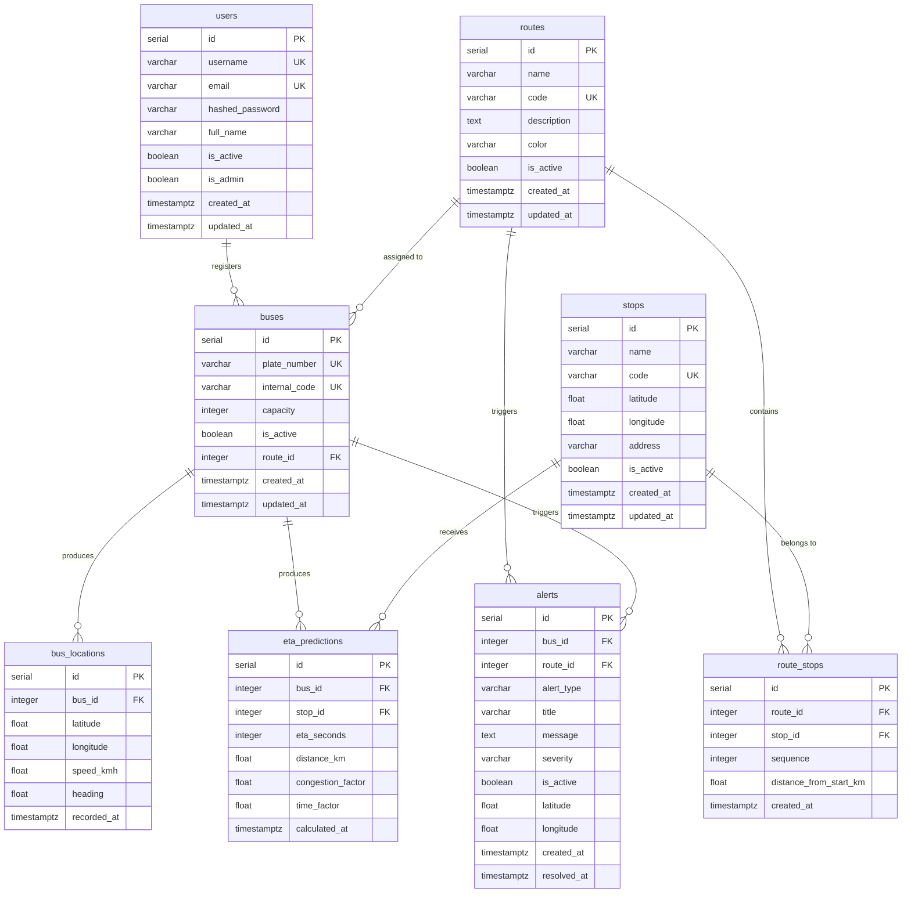

# MetroLinea - Entity Relationship Diagram

## Overview

## Relationships

| Relationship | Type | Description |
|---|---|---|
| routes → route_stops | 1:N | A route has many stops |
| stops → route_stops | 1:N | A stop belongs to many routes |
| routes → buses | 1:N | A route has many buses |
| buses → bus_locations | 1:N | A bus has many GPS records |
| buses → eta_predictions | 1:N | A bus has many ETA predictions |
| stops → eta_predictions | 1:N | A stop has many ETA predictions |
| buses → alerts | 1:N | A bus can trigger many alerts |
| routes → alerts | 1:N | A route can have many alerts |

## Constraints

| Table | Constraint | Type |
|---|---|---|
| route_stops | uq_route_stop | UNIQUE(route_id, stop_id) |
| alerts | chk_alert_type | IN (DELAY, CONGESTION, BUS_STOPPED, MAINTENANCE, ROUTE_CHANGE) |
| alerts | chk_severity | IN (LOW, MEDIUM, HIGH, CRITICAL) |
| stops | latitude | -90 to 90 |
| stops | longitude | -180 to 180 |

## Cascade Delete Rules

| Parent | Child | Action |
|---|---|---|
| routes | route_stops | CASCADE |
| stops | route_stops | CASCADE |
| buses | bus_locations | CASCADE |
| buses | eta_predictions | CASCADE |
| stops | eta_predictions | CASCADE |
| buses | alerts | CASCADE |
| routes | alerts | CASCADE |

## Indexes

All primary keys and foreign keys are indexed. Additional indexes:
- `idx_users_username`, `idx_users_email`
- `idx_routes_name`, `idx_routes_code`
- `idx_stops_name`, `idx_stops_code`
- `idx_buses_plate_number`, `idx_buses_internal_code`
- `idx_bus_locations_bus_time` (bus_id, recorded_at DESC)
- `idx_alerts_alert_type`, `idx_alerts_is_active`
